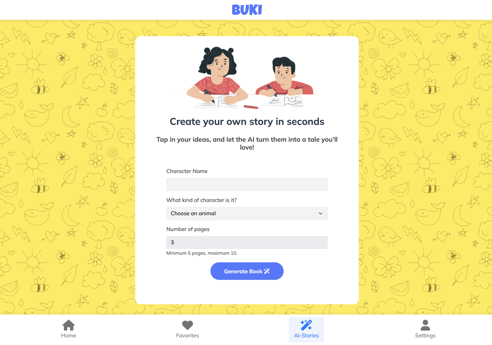
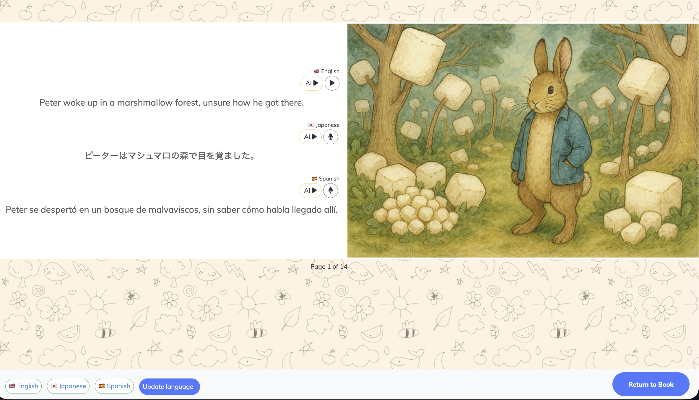

## 📚 BUKI — Multilingual Reading for Families

Designed for international families and parents introducing a second language to their children, this app offers a library of children’s books with multilingual options. Create your own stories, record your voice, or let the app read aloud in your chosen language—making storytime fun, interactive, and portable.

## 🌟 Features

🌍 Read in Any Language — Access children’s stories translated into multiple languages.

🗣️ Buki Reads Aloud — Built-in voice assistant that narrates books using natural text-to-speech.

👨‍👩‍👧 Family Profiles — Add to favourites and saved progress.

---

## screen shots

<div align="center">   </div> <div align="center">   </div>

---

## 🧩 Tech Stack

<div align="center"> <!-- Ruby -->  &nbsp;&nbsp; <!-- Rails -->  &nbsp;&nbsp; <!-- JavaScript -->  &nbsp;&nbsp; <!-- HTML5 -->  &nbsp;&nbsp; <!-- CSS3 -->  &nbsp;&nbsp; <!-- PostgreSQL -->  &nbsp;&nbsp; <!-- Heroku -->  &nbsp;&nbsp; <!-- AI --> </div>

## 🚀 Getting Started

```bash
# Clone the Repository
git clone https://github.com/Naw-sanbmo/BUKI.git
cd BUKI

# Install dependencies
rails bundle install

# Run the app locally
rails server

# Set up database
rails db:create
rails db:migrate
rails db:seed

dotenv
# Environment Variables
# in your .env file
DEEPL_API_KEY=your_deepl_api_key
CLOUDINARY_URL=your_cloudinary_key
ELEVENLABS_API_KEY=your_elevenlabs_api_key
ELEVENLABS=your_elevenlabs_key
VOICE_VOX_APIKEY=your_voice_vox_api_key
```
